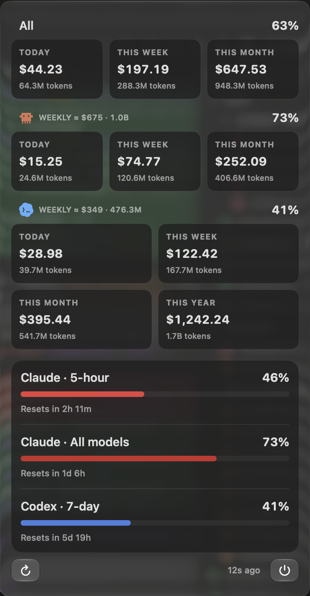

# Token Bar

A native macOS menu bar monitor for Claude Code and OpenAI Codex.

**macOS 14+ · Swift 5.10 · MIT**

<p align="center">
  
</p>

## At a glance

- 🟡 Claude quota windows and local token estimates
- 🔵 Codex quota windows and account activity
- ⚪ Capacity-weighted combined usage
- 🟠 Last-known values when a provider becomes stale
- 🔒 Local aggregation without raw transcript uploads
- 🧊 Liquid Glass on macOS 26 with a Material fallback

The dollar values show API-equivalent estimates, not subscription charges.
Screenshot values are examples.

## Build from source

Install Xcode 26 or newer, then run:

```sh
./scripts/build-app.sh
open "build/Token Bar.app"
```

Sign in to Claude Code, Codex CLI, or Codex Desktop before refreshing Token Bar.
Building and running the app does not require administrator access.
macOS may request access to the user's login Keychain for Claude usage data.

## How it works

Token Bar keeps provider quotas, local activity, and pricing as separate values.
One provider can fail without taking down the other or erasing its last successful reading.

🟡 Claude · 🔵 Codex · ⚪ available · 🔴 gauge center · 🟠 stale

Read the technical notes in [`docs/`](docs/README.md):

- [Accuracy and pricing](docs/PRICING.md)
- [Claude data boundaries](docs/CLAUDE-USAGE.md)
- [Architecture and performance](docs/ARCHITECTURE.md)
- [Local development](docs/DEVELOPMENT.md)
- [Design system](docs/DESIGN.md)
- [Signed distribution](docs/DISTRIBUTION.md)

## License

[MIT](LICENSE)

Token Bar is not affiliated with Anthropic, OpenAI, Bandai Namco, or Sunrise.
