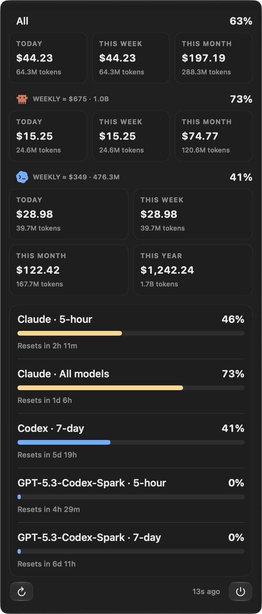
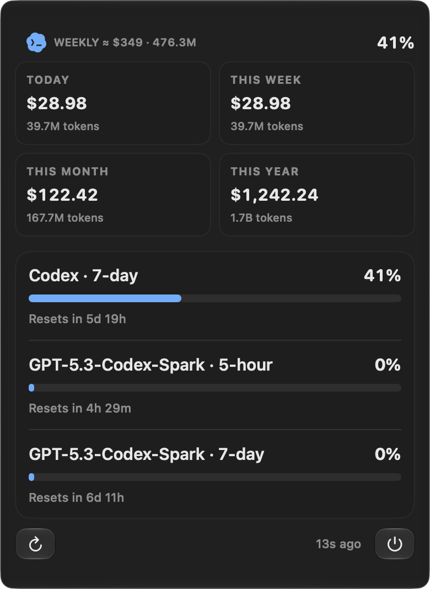
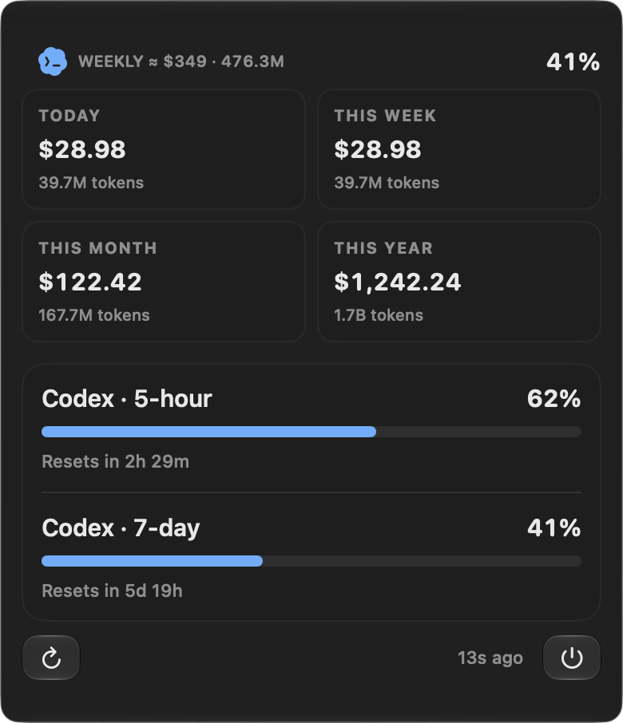
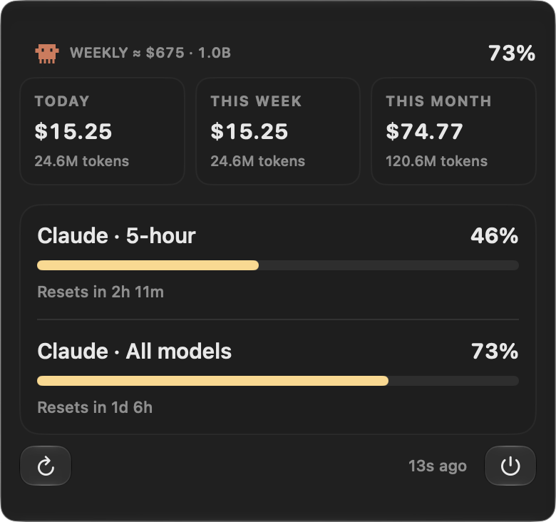

# Subscription preview gallery

Captured on September 6, 2026 from the local macOS app using `TOKENBAR_PREVIEW_STATE`.
These screenshots show synthetic usage data in the actual menu UI.
The dollar values represent fixture cost estimates, not subscription prices, bills, or guaranteed included value.

## Scope and sources

The four scenarios cover Pro with Claude, Pro alone, Plus alone, and Claude alone.
They do not compare the Pro 5x and Pro 20x tiers.

OpenAI lists five-hour usage estimates for Plus and Pro, notes that weekly limits may apply, and describes Spark as a Pro-only preview with a separate usage limit.
See [OpenAI pricing and usage documentation](https://learn.chatgpt.com/docs/pricing).
Do not infer the presence or absence of a quota window from the plan name alone.
Render the windows returned by the account API.

The Pro fixtures reproduce an observed response shape: a seven-day main Codex window and separate five-hour and seven-day Spark windows.
The response supplied `limitName: GPT-5.3-Codex-Spark` for `limitId: codex_bengalfox`.
This observed shape does not establish a rule for all Pro accounts.
The Plus fixture represents a response with five-hour and seven-day main windows and no Spark bucket.

Anthropic documents five-hour session limits and weekly all-model limits for Claude Pro.
See [Claude Pro plan documentation](https://support.claude.com/en/articles/8325606-what-is-the-pro-plan).
The Claude fixture uses those two windows.

## Pro with Claude

Preview state: `both-pro-spark`.
The overview combines the two providers; the quota rows keep Codex main usage ahead of the named Spark windows.



## Pro alone

Preview state: `codex-pro-spark`.
The app omits the combined overview and Claude content when only Codex is connected.



## Plus alone

Preview state: `codex-plus`.
This fixture includes both main Codex windows and no Spark quota.



## Claude alone

Preview state: `claude`.
The app omits Codex content and the combined overview.



## Reproduce locally

Build once:

```sh
./scripts/build-app.sh
```

Quit any running Token Bar instance before launching a preview to avoid duplicate status items.
Run one command at a time, then quit that preview before starting the next:

```sh
TOKENBAR_PREVIEW_STATE=both-pro-spark "build/Token Bar.app/Contents/MacOS/TokenBar"
TOKENBAR_PREVIEW_STATE=codex-pro-spark "build/Token Bar.app/Contents/MacOS/TokenBar"
TOKENBAR_PREVIEW_STATE=codex-plus "build/Token Bar.app/Contents/MacOS/TokenBar"
TOKENBAR_PREVIEW_STATE=claude "build/Token Bar.app/Contents/MacOS/TokenBar"
```

Preview mode skips account refreshes, snapshot loading, and legacy preference migration.
The app opens the menu after the status item has settled into position.
Launch the app without `TOKENBAR_PREVIEW_STATE` to return to normal account data.
Dates and reset countdowns depend on capture time, so later screenshots need not match pixel for pixel.

## Verification and related changes

During the capture run, the local release build and all 15 existing tests passed.
We captured and inspected all four native menu windows: one outer surface, complete Spark labels, and no unrelated provider content in single-provider scenarios.
This records one local macOS run, not coverage of every supported OS, display size, or subscription account.

The preceding fixes replaced the custom floating panel and mouse monitors with an `NSMenu` attached to the status item.
We removed the duplicate app-level glass background after adopting the native menu surface.
Quota parsing now preserves the server's display name, and the UI groups windows by quota bucket with the main Codex bucket first.
Older cached Spark windows use a known-name fallback instead of exposing the internal ID.

The local commit `adb2b85` introduced rendering of all returned Codex windows, deduplication, dynamic panel height, Plus fixtures, and quota-window tests.
The menu, display-name, and gallery work followed that commit.
Use `git status` and `git diff` for the current working-tree state; this gallery does not assert publication or deployment.
